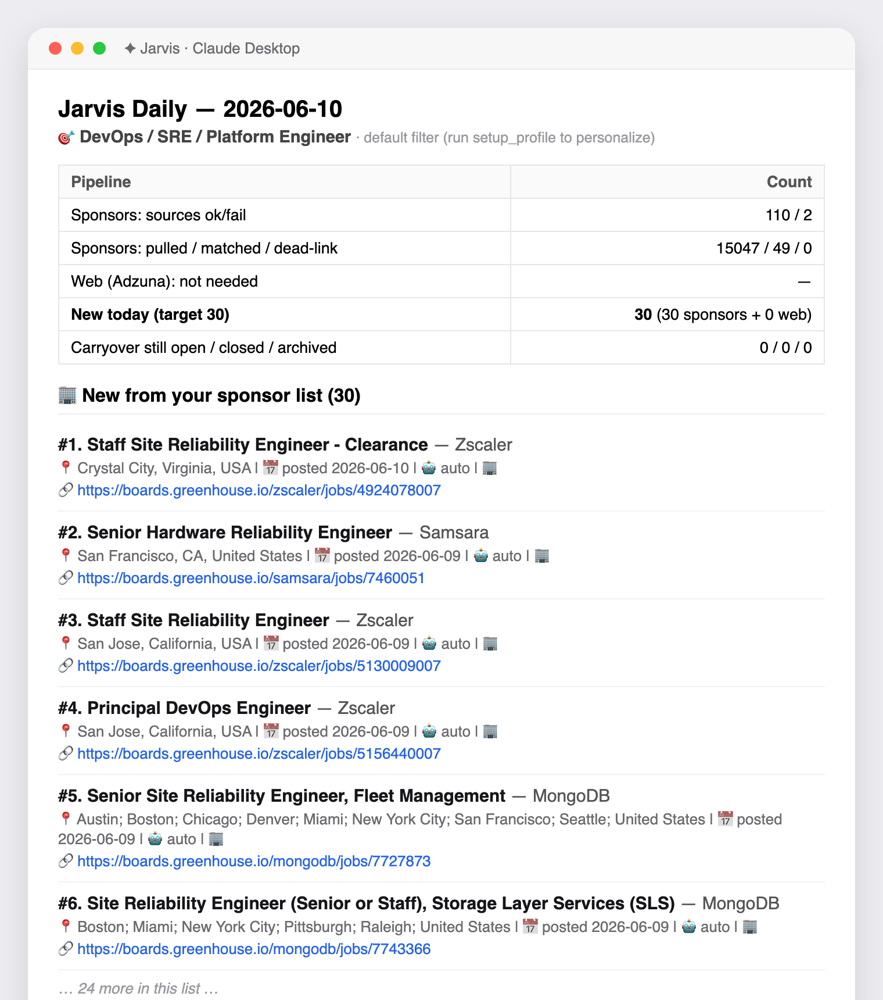

# Jarvis — Your Personal Job-Finding Assistant

Jarvis is a helper that lives inside the **Claude Desktop** app. Whenever you ask it to,
it finds **real, recent job openings that match your résumé** — and it only ever shows you
jobs that are genuinely worth your time.

You talk to it in plain English. You say **"wake up Jarvis"**, and a few seconds later you
get a tidy list of up to **30 brand-new jobs**, each one checked to make sure it:

- ✅ matches the kind of role on your résumé,
- ✅ was posted in the **last 14 days**,
- ✅ is located in the **United States**,
- ✅ isn't a repeat of something you've already seen, and
- ✅ has an **"Apply" link that actually works** (no dead pages, no fake listings).

There's no schedule and no waiting — it runs **only when you ask it to**.

> **You don't need to be technical to use this.** Follow the setup steps once (copy, paste,
> click), and after that it's all plain-English conversation.

---

## How it works — step by step

When you say **"wake up Jarvis"**, it runs a 6-stage assembly line. The diagram shows each
stage; the notes underneath explain **what** it does and **how** it does it.

```
                            You say: "wake up Jarvis"
                                        │
                                        ▼
  ┌────────────────────────────────────────────────────────────────────────┐
  │ STAGE 0 — RE-CHECK YESTERDAY'S JOBS  (the jobs already on your list)    │
  │ Re-opens each saved-but-not-applied job's link to see if it's still     │
  │ live, and re-checks it still fits your résumé. Dead/closed ones are     │
  │ marked closed; ones that no longer match are filed away.                │
  └───────────────────────────────────┬────────────────────────────────────┘
                                       ▼
  ┌────────────────────────────────────────────────────────────────────────┐
  │ STAGE 1 — ASK YOUR COMPANIES DIRECTLY  (your sponsors.yaml list)        │
  │ For every company on your list, Jarvis calls that company's official    │
  │ jobs feed — the very system their careers page runs on — and downloads  │
  │ all their currently-open roles, with real titles, dates and links.      │
  └───────────────────────────────────┬────────────────────────────────────┘
                                       │  still need more to reach 30?
                                       ▼
  ┌────────────────────────────────────────────────────────────────────────┐
  │ STAGE 2 — SEARCH THE WIDER WEB  (only to fill leftover slots)           │
  │ Asks the Adzuna jobs service for postings that match your résumé        │
  │ keywords, are in the US, and were posted in the last 14 days.           │
  └───────────────────────────────────┬────────────────────────────────────┘
                                       │  one big pile of candidate jobs
                                       ▼
  ┌────────────────────────────────────────────────────────────────────────┐
  │ STAGE 3 — THE FILTER  (every single job is checked, one by one)         │
  │   a) Real source?   came from a real jobs system, not an ad/redirect    │
  │   b) Fresh?         posted within 14 days, using the real post date     │
  │   c) Right role?    title matches your résumé's keywords                │
  │   d) In the US?     location is the United States                       │
  │   e) Eligible?      not clearance / citizens-only (visa-ineligible)     │
  │   f) New to you?    not already somewhere on your list                  │
  │   g) Link works?    Jarvis actually opens the Apply link to confirm     │
  │   Fail any one → thrown out (and counted, so nothing is hidden)         │
  └───────────────────────────────────┬────────────────────────────────────┘
                                       │  only the jobs that passed everything
                                       ▼
  ┌────────────────────────────────────────────────────────────────────────┐
  │ STAGE 4 — SORT & TRIM                                                   │
  │ Newest first, your-companies ahead of web results, then keep the top 30.│
  └───────────────────────────────────┬────────────────────────────────────┘
                                       ▼
  ┌────────────────────────────────────────────────────────────────────────┐
  │ STAGE 5 — HAND IT TO YOU + REMEMBER IT                                  │
  │ Shows up to 30 brand-new jobs, plus the still-open carryover in a       │
  │ separate list, and saves everything so next time it knows what you've   │
  │ already seen.                                                           │
  └────────────────────────────────────────────────────────────────────────┘
```

### What each stage does, and how

**Stage 0 — Re-check yesterday's jobs (carryover).**
*What:* keeps your earlier finds honest so you're never sent to a job that's already gone.
*How:* it takes every job you saved but haven't marked "applied," opens each Apply link to
confirm it still loads, and re-runs it through your résumé filter. Links that no longer load
are marked **closed**; jobs that no longer match are **archived**. The rest stay as "still
open" and appear in the separate carryover list at the bottom.

**Stage 1 — Ask your companies directly.**
*What:* gets jobs straight from the companies you care about — first, and most reliably.
*How:* each company on your list publishes its openings through an "ATS" (the hiring software
behind its careers page — Greenhouse, Lever, Ashby or Workday). Jarvis asks that software
directly for the company's current openings, so it gets the **real** job title, the **real**
posting date, and a **real** apply link — not a guess scraped off a search engine.

**Stage 2 — Search the wider web.**
*What:* casts a net beyond your own list, but only enough to top the day up to 30.
*How:* it sends your résumé keywords to the **Adzuna** jobs service (a search engine just for
jobs) and asks only for US postings from the last 14 days. This runs **only if** Stage 1
didn't already produce 30, and only fills the slots that are left.

**Stage 3 — The filter (the important part).**
*What:* this is where false, stale, foreign, off-target, or dead jobs get removed — every job
is inspected on its own.
*How:* each candidate must pass seven quick checks (real source, ≤14 days old, title matches
your role, US location, visa-eligible, not a duplicate, and — last — Jarvis literally opens
the Apply link to make sure it works). The moment a job fails one check it's dropped, and the
reason is tallied so you can see exactly why on the scoreboard. Nothing is silently discarded.

**Stage 4 — Sort & trim.**
*What:* puts the best jobs at the top and caps the list at 30.
*How:* survivors are ordered newest-first, with your own companies ranked ahead of web finds,
then the top 30 are kept.

**Stage 5 — Hand it to you and remember it.**
*What:* shows you the result and makes sure tomorrow doesn't repeat today.
*How:* it prints up to 30 brand-new jobs (with a small scoreboard of what was rejected and
why), lists the still-open carryover separately underneath, and saves every new job to your
tracker so it's never shown to you twice.

### Two rules worth remembering

1. **Your own company list comes first.** The 30 are filled from your saved companies before
   the web is even touched; the web only tops up the remainder.
2. **You always get up to 30 *brand-new* jobs.** Carryover (older jobs you haven't applied to)
   is shown in a *separate* list and never uses up your 30. As you apply to them — or they get
   filled and close — they drop off on their own.

If a day only has 12 good jobs, you get 12. Jarvis never pads the list with junk to reach 30.

---

## What you'll need before you start

A short shopping list. Don't worry — everything here is free.

| What | Why you need it | Where to get it |
|------|-----------------|-----------------|
| A **Mac or Windows computer** | Jarvis runs on either | (you have one) |
| The **Claude Desktop app** | Jarvis lives inside it | [claude.ai/download](https://claude.ai/download) |
| Your **résumé as a Word file** (`.docx`) | So Jarvis knows what jobs suit you | Export from Word / Google Docs / Pages |
| An **Anthropic key** (free) | Lets Jarvis read your résumé to learn your target role | [console.anthropic.com](https://console.anthropic.com) → API Keys |
| An **Adzuna key** (free) | Lets Jarvis search the wider web for jobs | [developer.adzuna.com](https://developer.adzuna.com) → register |

> A "key" is just a long password that lets Jarvis talk to another service on your behalf.
> You'll paste them in once during setup and never think about them again.

You can actually start *without* the keys (Jarvis will use a default "DevOps/SRE" job filter
and search only your saved companies), but to get jobs matched to **your** résumé and to
search the wider web, add both keys. It's a 5-minute, one-time thing.

---

## Setup (do this once)

Take it slow and do these in order. Each step says exactly what to type or click.

> **On Windows?** Jarvis works exactly the same — only a few commands differ. Wherever a
> step says **"Terminal"**, use **PowerShell** instead (click Start, type `PowerShell`,
> press Enter). And swap in these Windows versions:
>
> | What | Mac version | Windows version |
> |------|-------------|-----------------|
> | Make the venv | `python3 -m venv .venv` | `python -m venv .venv` |
> | Install / check | `./.venv/bin/python ...` | `.\.venv\Scripts\python ...` |
> | The `"command"` path in the settings | `.../.venv/bin/python` | `...\.venv\Scripts\python.exe` |
> | The settings file | `~/Library/Application Support/Claude/claude_desktop_config.json` | `%APPDATA%\Claude\claude_desktop_config.json` (paste that into File Explorer's address bar) |
> | Copy your résumé in | `cp ~/Downloads/MyResume.docx profile/resume_base.docx` | `copy %USERPROFILE%\Downloads\MyResume.docx profile\resume_base.docx` |
> | Show the folder path | `pwd` | `pwd` (works in PowerShell too) |
>
> In the settings file, write Windows paths with **double backslashes**, e.g.
> `"C:\\Users\\you\\jarvis-job-agent\\.venv\\Scripts\\python.exe"` (forward slashes also
> work). That's the only catch. The optional timed-run script (`run_daily.sh`) is Mac/Linux
> only — on Windows use Task Scheduler if you ever want one, but you don't need it.

### Step 1 — Get the project onto your computer

1. Open the **Terminal** app. (Press `Cmd + Space`, type `Terminal`, press Enter. A black or
   white text window opens — that's where you type the commands below.)
2. Copy-paste this line and press Enter to download the project to your home folder:
   ```bash
   git clone https://github.com/Vegeta3069/jarvis-job-agent.git
   ```
3. Move into the project folder:
   ```bash
   cd jarvis-job-agent
   ```

### Step 2 — Install Jarvis's building blocks

Paste these one at a time (press Enter after each):

```bash
python3 -m venv .venv
./.venv/bin/python -m pip install -r requirements.txt
```

Then check it worked — paste this and you should see `deps ok`:

```bash
./.venv/bin/python -c "import mcp, yaml, requests, docx; print('deps ok')"
```

### Step 3 — Get your two free keys

- **Anthropic key:** sign in at [console.anthropic.com](https://console.anthropic.com),
  go to **API Keys**, click **Create Key**, and copy the long string (it starts with
  `sk-ant-...`).
- **Adzuna key:** register at [developer.adzuna.com](https://developer.adzuna.com). They
  give you an **App ID** and an **App Key** — copy both.

Keep these handy for the next step.

### Step 4 — Connect Jarvis to Claude Desktop

Jarvis plugs into Claude Desktop through one settings file. Open it by pasting this in
Terminal:

```bash
open -e "$HOME/Library/Application Support/Claude/claude_desktop_config.json"
```

> If that file doesn't exist yet, create it: `touch "$HOME/Library/Application Support/Claude/claude_desktop_config.json"` and run the `open` command again.

Paste in the block below. **Replace the two `REPLACE_WITH_...` paths and the three keys**
with your real values, then save and close.

```json
{
  "mcpServers": {
    "jarvis": {
      "command": "REPLACE_WITH_FULL_PATH/jarvis-job-agent/.venv/bin/python",
      "args": ["REPLACE_WITH_FULL_PATH/jarvis-job-agent/jarvis_mcp.py"],
      "env": {
        "ANTHROPIC_API_KEY": "sk-ant-...your key...",
        "ADZUNA_APP_ID": "...your Adzuna app id...",
        "ADZUNA_APP_KEY": "...your Adzuna app key..."
      }
    }
  }
}
```

To find the full path to write in place of `REPLACE_WITH_FULL_PATH`, paste this in Terminal
and copy what it prints:

```bash
pwd
```

(For example it might print `/Users/yourname` — so the command line becomes
`/Users/yourname/jarvis-job-agent/.venv/bin/python`.)

### Step 5 — Add your résumé

Put your résumé into the project's `profile` folder with this **exact** name. Replace the
first path with where your résumé actually is:

```bash
cp ~/Downloads/MyResume.docx profile/resume_base.docx
```

### Step 6 — Wake up Claude and teach Jarvis about you

1. **Quit and reopen Claude Desktop** (so it picks up the new settings).
2. In a chat, type: **"set up my profile"**. Jarvis reads your résumé and figures out which
   job titles to look for. You'll see it confirm your target role.
3. That's it — type **"wake up Jarvis"** to get your first list of jobs.

You only repeat Step 5 + "set up my profile" if you change your résumé later.

---

## Using Jarvis every day

Just talk to it. Here's everything you can say:

| Say this | What happens |
|----------|--------------|
| **"wake up Jarvis"** | The main one. Gives you up to **30 brand-new jobs** (your companies first, then the web), plus any earlier jobs you haven't applied to. |
| **"set up my profile"** | Re-reads your résumé and updates what roles Jarvis looks for. Do this after editing your résumé. |
| **"list today's jobs"** / **"show my pending jobs"** | Shows your jobs as a numbered list. |
| **"tailor my resume for #14"** | Writes a résumé tweaked for job #14 (it only re-emphasises things already on your résumé — it never makes things up). Saved in the `resumes` folder. |
| **"mark 14 applied"** | Marks job #14 as applied so it stops showing up. |
| **"show my stats"** | How many jobs you've found and applied to. |
| **"search just my companies"** | Searches only your saved company list (skips the web). |
| **"search just the web"** | Searches only the wider web (skips your company list). |

> **The number matters.** Every job has a permanent number like `#14`. Use that number when
> you say "tailor my resume for #14" or "mark 14 applied".

---

## Understanding what Jarvis shows you

Every run gives you a clean, scannable report. Here's an **actual run** (real jobs pulled
live from the sponsor feeds, using the default DevOps/SRE filter):



And the same kind of output written out as text, so you can see the full structure:

```text
# Jarvis Daily — 2026-06-10

**Target role:** Senior DevOps / SRE Engineer

| Pipeline | Count |
|---|---|
| Sponsors: sources ok/fail                 | 112 / 0 |
| Sponsors: pulled / matched / dead-link    | 15330 / 47 / 1 |
| Web (Adzuna): ok                          | 240 fetched, 22 kept |
| **New today (target 30)**                 | **30**  (8 sponsors + 22 web) |
| Carryover still open / closed / archived  | 5 / 1 / 0 |

---

## 🏢 New from your sponsor list (8)

**#118. Senior Site Reliability Engineer** — Datadog
   📍 New York, NY | 📅 posted 2026-06-09 | 🤖 auto | 🏢
   🔗 https://boards.greenhouse.io/datadog/jobs/7183013

**#119. Senior DevOps Engineer** — Stripe
   📍 San Francisco, CA | 📅 posted 2026-06-08 | 🤖 auto | 🏢
   🔗 https://boards.greenhouse.io/stripe/jobs/7532733

   …6 more…

## 🌐 New from the web — every link verified (22)

**#126. Platform Engineer, Kubernetes** — Recursion
   📍 Salt Lake City, UT | 📅 posted 2026-06-09 | 🖐 manual | 🏢
   🔗 https://www.adzuna.com/land/ad/4983210155

   …21 more…

---

## 🔁 Carryover — still open from earlier days (5, not counted in the 30)

**#94. Staff Site Reliability Engineer** — Okta
   📍 Remote - US | 📅 posted 2026-06-02 | 🖐 manual | 🏢
   🔗 https://boards.greenhouse.io/okta/jobs/7839826

   …4 more…

---
💬 'mark N applied' · 'tailor resume N' · 30/30 new today · 5 carried over
```

**How to read it**

- The **scoreboard** at the top is the honesty check: how many sources answered, how many raw
  postings were pulled, how many survived, and how many were kept.
- Each job line shows the **#number** (use it to say *"mark 118 applied"*), the title and
  company, then 📍 location · 📅 real post date · the apply style (🤖 auto = one-click ATS,
  🖐 manual) · 🏢 direct employer (vs 🏗 consultancy), and the 🔗 working apply link.
- The three sections are always in this order: **your companies → the web → carryover**.

- **closed / archived** in the scoreboard — jobs that disappeared (the posting was taken
  down) or no longer match your résumé; Jarvis tidies these away automatically.

Nothing is ever hidden: every job Jarvis looked at is either shown to you or counted as
"rejected" for a clear reason (too old, wrong location, dead link, etc.).

---

## Customizing your list of companies

The companies Jarvis checks **first** live in a file called `sponsors.yaml`. It already comes
with 100+ well-known companies. To add your own, open the file and add a line like one of
these:

```yaml
  - {name: Stripe,    ats: greenhouse, token: stripe}
  - {name: Netflix,   ats: lever,      token: netflix}
  - {name: Snowflake, ats: ashby,      token: snowflake}
```

The `token` is the company's name as it appears in its careers-page web address (e.g.
`boards.greenhouse.io/stripe` → the token is `stripe`). If you get one wrong, Jarvis simply
skips it and tells you — it never breaks the run. Not sure how? Just tell Jarvis the company
name in chat and ask it to add it.

---

## Your privacy

Everything personal stays **on your computer only**:

- your résumé, the jobs you've tracked, your tailored résumés, and your keys are **never**
  uploaded or shared, and are excluded from the public code.
- The only things stored online are the program's code and the public company list.

---

## Troubleshooting

**"Jarvis didn't appear / nothing happens when I say wake up Jarvis."**
Make sure you fully quit and reopened Claude Desktop after Step 4. Double-check the two paths
in the settings file point to the real `jarvis-job-agent` folder.

**The jobs don't match my field (I'm not a DevOps engineer).**
You haven't set your profile yet, so Jarvis is using its default filter. Add your Anthropic
key (Step 3–4), put your résumé in place (Step 5), and say **"set up my profile."**

**The scoreboard says "Web (Adzuna): skipped (no ADZUNA key)."**
That just means the web half is off. Jarvis still gives you jobs from your company list. To
turn on web search, add your Adzuna App ID + Key in the settings file (Step 4).

**I got fewer than 30 jobs.**
That's normal and honest — there just weren't 30 fresh, US, matching, working-link jobs today.
Jarvis won't pad the list with junk.

**A job's "Apply" link is dead.**
Rare, but possible if a company puts up a "this job is closed" page that still loads. Tell
Jarvis and it can be made stricter.

---

## Advanced (optional — you can ignore this)

- **Run it from the command line** (no Claude): `python apply.py list`, `apply <n>`, or `stats`.
- **Run it on a timer:** `run_daily.sh` performs the same daily run; you *can* schedule it
  with cron/launchd, but this is entirely optional — by default Jarvis only runs when you ask.

---

## Under the hood (for the curious)

Jarvis sources jobs **only** from official Applicant Tracking System (ATS) feeds
(Greenhouse, Lever, Ashby, Workday) and the Adzuna jobs API — never by scraping search
engines — which is why dead links and fake listings are almost impossible. Every posting
passes these gates before you see it:

| Gate | Rejects |
|------|---------|
| Domain allowlist | anything not from a real ATS / the jobs API |
| Dedup | repeats (within the run and vs. everything you've already seen) |
| Freshness | postings older than 14 days (using the real post date, never scrape time) |
| Title | titles that don't match your résumé's role filter |
| US location | non-US or unknown locations (never guesses "USA") |
| Eligibility | clearance / citizenship-only roles (visa-ineligible) |
| Liveness | apply links that don't open (checked live, in parallel) |

### What's in this folder

| File | What it is |
|------|------------|
| `jarvis_mcp.py` | The assistant itself — all the things you can say to it |
| `jarvis_sourcing.py` | The engine that pulls + filters jobs from your company list |
| `web_sourcing.py` | The engine that pulls + filters jobs from the wider web (Adzuna) |
| `sponsors.yaml` | Your editable list of companies |
| `profile.example.yaml` | Example of the résumé-derived filter Jarvis generates |
| `apply.py` | Optional command-line way to view/mark your jobs |
| `job_agent.py` / `run_daily.sh` | Optional way to run it on a schedule |
| `requirements.txt` | The building blocks installed in Step 2 |

---

*Jarvis runs inside Claude Desktop. Résumé tailoring uses Anthropic's Claude and only
re-emphasises real experience from your résumé — it never invents anything.*
